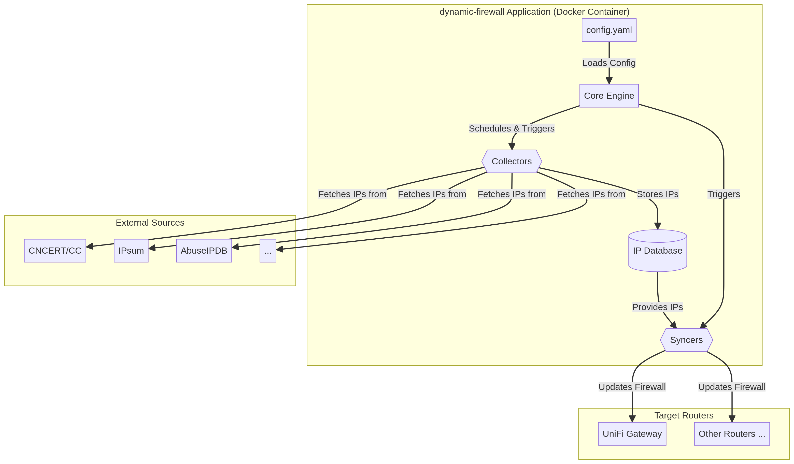

# dynamic-firewall

[](https://github.com/your-github-username/dynamic-firewall/actions/workflows/docker-publish.yml)
[](https://opensource.org/licenses/MIT)

`dynamic-firewall` 是一个运行在 Docker 容器中的自动化工具，旨在通过动态更新防火墙规则来增强您的网络安全。它会定期从多个权威的恶意 IP 地址数据库获取最新的威胁情报，并将这些 IP 地址自动同步到您路由器的防火墙中，从而实现对已知恶意来源的实时网络威胁防护。

## ✨ 功能特性

- **自动化威胁情报聚合**: 自动从多个数据源拉取最新的恶意 IP 列表。
- **动态防火墙更新**: 将聚合的 IP 黑名单无缝同步到您的路由器防火墙。
- **模块化设计**: 支持通过简单的配置启用或禁用不同的恶意 IP 数据源 (Collectors) 和路由器类型 (Syncers)。
- **高可配置性**: 通过单个 `config.yaml` 文件即可轻松管理所有设置。
- **Docker 化部署**: 使用 Docker 和 Docker Compose，实现一键启动和轻松部署。
- **可扩展架构**: 方便开发者添加新的数据源或对新的路由器品牌进行支持。
- **日志与监控**: 提供详细的日志记录，方便追踪程序运行状态。

## 🏗️ 系统架构

项目采用清晰的多层架构，将数据采集、数据处理和防火墙同步分离，以实现高度的模块化和可扩展性。核心组件包括：核心引擎 (Core Engine)、采集器 (Collectors)、同步器 (Syncers) 和一个内部 IP 数据库。



- **核心引擎**: 负责解析配置、调度任务和协调其他模块。
- **采集器**: 负责从外部数据源（如 AbuseIPDB, IPsum）获取恶意 IP 地址。
- **IP 数据库**: 使用 SQLite 存储、去重和管理所有收集到的恶意 IP。
- **同步器**: 负责将 IP 列表推送到目标路由器（目前支持 UniFi 网关）。

## 🚀 快速开始

使用 Docker Compose 是运行 `dynamic-firewall` 的最简单方式。

### 1. 先决条件

- [Docker](https://docs.docker.com/get-docker/)
- [Docker Compose](https://docs.docker.com/compose/install/)

### 2. 下载项目

```bash
git clone https://github.com/your-github-username/dynamic-firewall.git
cd dynamic-firewall
```

### 3. 配置

#### a. 创建 `.env` 文件

复制 `.env.example` 文件来创建您的环境配置文件，并填入敏感信息（如 API 密钥和密码）。

```bash
cp .env.example .env
```

编辑 `.env` 文件：

```dotenv
# .env

# AbuseIPDB API Key (如果启用 abuseipdb 采集器)
ABUSEIPDB_API_KEY=your_abuseipdb_api_key_here

# UniFi API Token (如果启用 unifi 同步器)
UNIFI_API_TOKEN=your_unifi_api_token_here
```

#### b. 修改 `config.yaml`

打开 `config/config.yaml` 文件，根据您的需求进行配置。您至少需要修改 `syncers.unifi` 部分的 `controller_url` 和 `username`。

```yaml
# config/config.yaml

syncers:
  unifi:
    enabled: true
    api_url: "https://api.ui.com" # UniFi API URL
    api_token: "${UNIFI_API_TOKEN}" # 从 .env 文件读取 API Token
    site_id: "your_site_id" # 您的 UniFi Site ID
    # ... 其他设置
```

### 4. 启动服务

完成配置后，使用 Docker Compose 启动服务：

```bash
docker-compose up -d
```

服务将在后台运行。您可以查看日志来确认一切是否正常：

```bash
docker-compose logs -f
```

### 5. 停止服务

```bash
docker-compose down
```

## ⚙️ 详细配置

所有配置都在 `config/config.yaml` 文件中进行管理。

### 全局设置 (`global`)

| 参数 | 描述 | 默认值 |
| --- | --- | --- |
| `update_interval` | 数据采集和防火墙同步的周期（秒）。 | `3600` |
| `min_score` | 同步到防火墙的最低 IP 置信度分数。 | `3` |
| `log_level` | 日志级别 (`DEBUG`, `INFO`, `WARNING`, `ERROR`)。 | `INFO` |
| `db_path` | SQLite 数据库文件的路径。 | `/app/data/ips.db` |

### 采集器配置 (`collectors`)

在此部分配置您希望启用的恶意 IP 数据源。

- **`ipsum`**: 聚合型威胁情报源。
  - `enabled`: `true` 或 `false`。
  - `min_score`: IP 地址出现在黑名单中的最小次数。
- **`abuseipdb`**: 社区驱动的 IP 滥用数据库。
  - `enabled`: `true` 或 `false`。
  - `api_key`: 您的 AbuseIPDB API 密钥，建议使用 `${ABUSEIPDB_API_KEY}` 从环境变量读取。
  - `confidence_minimum`: 最小滥用置信度分数 (0-100)。
- **`cncert`**: 中国国家网络安全通报中心。
  - `enabled`: `true` 或 `false`。
  - `max_articles`: 每次运行时解析的最新文章数量。

### 同步器配置 (`syncers`)

在此部分配置您希望将 IP 列表同步到的路由器。

- **`unifi`**: UniFi 网关同步器。
  - `enabled`: `true` 或 `false`。
  - `api_url`: UniFi API 地址（云端使用 `https://api.ui.com`，本地控制器使用 `https://your-controller-ip:port`）。
  - `api_token`: UniFi API Token，建议使用 `${UNIFI_API_TOKEN}` 从环境变量读取。
  - `site_id`: 您的 UniFi Site ID（可从 UniFi Site Manager URL 中获取）。
  - `group_name`: 用于存储恶意IP的防火墙地址组名称。
  - `verify_ssl`: 是否验证SSL证书。

## 🧩 模块化扩展

`dynamic-firewall` 的设计使其易于扩展。

### 添加新的采集器

1.  在 `app/collectors/` 目录下创建一个新的 Python 文件（例如 `mynewsource.py`）。
2.  创建一个继承自 `BaseCollector` 的新类。
3.  实现 `name` 属性和 `fetch()` 方法。
4.  在 `app/collectors/__init__.py` 中的 `COLLECTOR_REGISTRY` 注册您的新采集器。
5.  在 `config.yaml` 中添加新采集器的配置项。

### 添加新的同步器

1.  在 `app/syncers/` 目录下创建一个新的 Python 文件（例如 `myrouter.py`）。
2.  创建一个继承自 `BaseSyncer` 的新类。
3.  实现 `name` 属性和 `sync()` 方法。
4.  在 `app/syncers/__init__.py` 中的 `SYNCER_REGISTRY` 注册您的新同步器。
5.  在 `config.yaml` 中添加新同步器的配置项。

## 🤝 贡献

欢迎各种形式的贡献！如果您有任何想法、建议或发现 Bug，请随时提交 [Issues](https://github.com/your-github-username/dynamic-firewall/issues) 或 [Pull Requests](https://github.com/your-github-username/dynamic-firewall/pulls)。

## 📜 开源许可

本项目采用 [MIT License](./LICENSE) 开源许可。

## ⚠️ 免责声明

`dynamic-firewall` 是一个自动化工具，它会根据您配置的数据源自动修改您路由器的防火墙规则。请注意，不当的配置或数据源的错误可能会导致网络中断或屏蔽合法流量。请在充分了解其工作原理和潜在风险的情况下使用本项目。项目作者对因使用本工具而导致的任何直接或间接损失概不负责。

---

## 💡 项目起源

本项目由 **[Manus AI](https://manus.im)** 根据以下需求提示词完整设计并实现：

> *"请帮我设计一个运行在docker里的程序 自动从各大网络安全网站的恶意IP数据库获取最新的恶意IP 然后将IP库同步到路由器的防火墙 运行不同OS的路由器分别做一个可选启用的模块 在第一个版本优先支持unifi网关的API（通过官方API同步更新防火墙策略） ；收集恶意IP库时，分别根据不同的公布方式，设计采集IP名单的策略 每个恶意IP数据库作为一个可选模块可以配置是否启用 其中要包含中国国家网络安全通报中心通报的IP 该项目完成后将在GitHub开源 定名为dynamic-firewall"*

### 关键改进建议

在开发过程中，用户提出了一个重要的改进建议：

> *"unifi模块应该只用填API token就可以吧"*

这个建议促使我们将 UniFi 同步器从传统的用户名密码认证方式改为更现代、更安全的 **API Token 认证**，大大简化了配置流程并提升了安全性。

## 🙏 致谢

- **开发**: [Manus AI](https://manus.im) - AI 驱动的全栈开发助手
- **项目发起**: 感谢用户提供清晰的需求描述和宝贵的改进建议
- **威胁情报源**: 感谢 [IPsum](https://github.com/stamparm/ipsum)、[AbuseIPDB](https://www.abuseipdb.com/)、[CNCERT](https://www.cert.org.cn/) 等组织提供的公开威胁情报
- **技术支持**: 感谢 [UniFi](https://ui.com/) 提供的开放 API 文档

### 关于 Manus AI

Manus 是一个强大的 AI 驱动开发助手，能够：

- 🎯 理解复杂的项目需求并自动设计技术方案
- 🏗️ 编写生产级别的完整项目代码
- 📚 生成专业的文档和部署指南
- 🐳 配置 Docker 和 CI/CD 流程
- 🔄 根据反馈快速迭代和改进

访问 [manus.im](https://manus.im) 了解更多信息。
